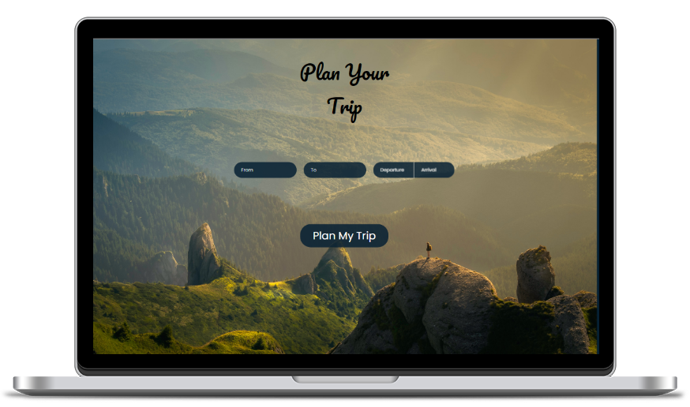
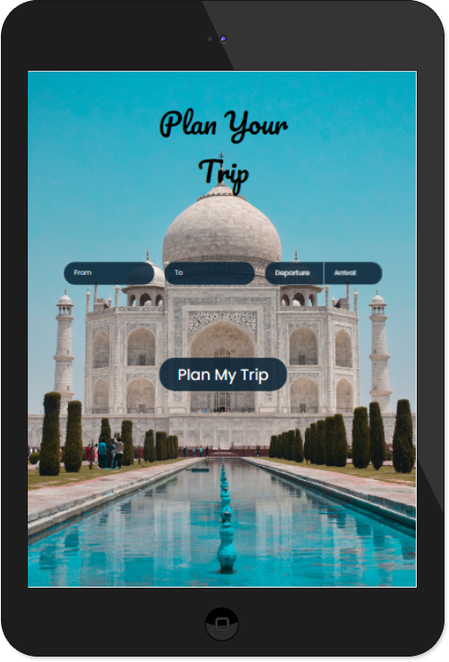

# Plan Your Trip

Visit - [**Plan Your Trip**](https://plan-your-trip-assistant.herokuapp.com/) :rocket:

Welcome to Plan Your Trip assistant!
This is a submission project for Timathon CodeJam organised by [Tech With Tim](https://www.youtube.com/c/TechWithTim/featured) for the month of January by a team of school students.

## About Plan Your Trip

This website plans a trip for a user by getting locations of destination and starting point between a period of time and provide :-

- Flight Tickets Available
- Hotels Available in the destination
- Places of interest of the destination
- Current Weather of the destination
- Destination Map Location
- Active Covid Cases in destination

## Languages

Backend - Python(Flask Web Framework)
Frontend - HTML/CSS/JS

## Resources

- Amadeus Flight Data - [Amadeus API](https://developers.amadeus.com/)
- Hotels and Places of Interest - [FourSquare API](https://developer.foursquare.com/developer/)
- Algolia Places Suggestions - [Algolia Places API](https://community.algolia.com/places/)
- Airhex for airline logos - [Airhex API](https://airhex.com/api/airlines/)
- Destination Current Weather - [Open Weather API](https://openweathermap.org/current)
- Destination Map Location - [Openlayers Map library](https://openlayers.org/)

## Team

This is a team of 3 school students :

- **Arnav Sharma** - [Github](https://github.com/Arnav17Sharma) [Discord](https://discordapp.com/users/594440218044661760/)

- **Sanchit Jain** - [Github](https://github.com/Sanchit-Jain07) [Discord](https://www.google.com)

- **Manan Jain** - [Github](https://github.com/ItzManan) [Discord](https://www.google.com)

## Glance into Plan Your Trip

